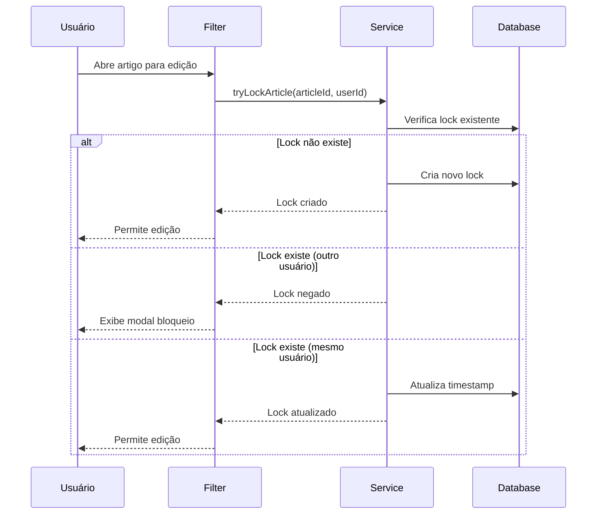

# 🔒 Article Edit Lock Service

> **Sistema de bloqueio de edição simultânea para artigos no Liferay DXP**

## 📋 Visão Geral

O **Article Edit Lock** é um módulo que implementa controle de concorrência para edição de artigos no Liferay Journal, impedindo que múltiplos usuários editem o mesmo conteúdo simultaneamente.

## 🏗️ Arquitetura

```
article-edit-lock/
├── article-edit-lock-api/          # Interfaces e modelos públicos
├── article-edit-lock-service/      # Implementação dos serviços
└── article-edit-lock-web/          # Filtros, servlets e componentes web
```

## ⚙️ Como Funciona

### 1. **Criação de Lock**
Quando um usuário abre um artigo para edição:
- O sistema verifica se existe um lock ativo
- Se não houver, cria um novo lock associando o artigo ao usuário
- Se houver, exibe modal informando quem está editando

### 2. **Liberação Automática**
O lock é liberado automaticamente quando:
- ✅ O artigo é salvo ou publicado
- ✅ O usuário navega para outra página
- ✅ A aba/janela do navegador é fechada
- ✅ O tempo de expiração é atingido (configurável)

### 3. **Limpeza de Locks Expirados**
- Job schedulado executa periodicamente
- Remove locks inativos há mais de X minutos/horas
- Configuração padrão: execução a cada 2 minutos

## 🔧 Componentes Principais

### **Service Layer**

```java
ArticleEditLockLocalService
├── tryLockArticle()           // Tenta criar lock para edição
├── unlockArticle()            // Libera o lock do artigo
├── isArticleLockedByOtherUser() // Verifica se está bloqueado
├── getEditingUser()           // Obtém usuário que está editando
└── cleanExpiredLocks()        // Remove locks expirados
```

### **Web Filters**

| Filter | Função |
|--------|---------|
| `JournalEditLockFilter` | Intercepta abertura de artigos e verifica/cria locks |
| `JournalExitDetectionFilter` | Detecta saída da página de edição |
| `JournalPublishActionFilter` | Libera lock ao salvar/publicar |
| `JournalHeaderPortalPortletFilter` | Injeta JavaScript para detectar fechamento de aba |

### **Endpoint HTTP**

```
POST /o/article-lock/unlock
Content-Type: application/x-www-form-urlencoded
Body: articleId={articleId}
```

## 🗄️ Modelo de Dados

```sql
ArticleLock_ArticleEditLock
├── articleEditLockId (PK)
├── articleId          -- ID do artigo bloqueado
├── userId             -- ID do usuário editando
├── userName           -- Nome do usuário
├── userFullName       -- Nome completo
├── locked             -- Status do lock (true/false)
├── lockTime           -- Timestamp do lock
├── groupId            -- ID do site
├── companyId          -- ID da instância
├── createDate         -- Data de criação
└── modifiedDate       -- Data de modificação
```

## ⏱️ Configurações de Tempo

```java
// Desenvolvimento (5 minutos)
long fiveMinutesInMillis = 5 * 60 * 1000;

// Produção (2 horas) - Descomentado no código
// long twoHoursInMillis = 2 * 60 * 60 * 1000;
```

## 🚀 Fluxo de Execução



## 📝 Instalação

1. Compile o módulo:
```bash
gradle build
```

2. Deploy no Liferay:
```bash
gradle deploy
```

3. O serviço iniciará automaticamente com o portal

## 🔍 Logs

O sistema registra todas as operações de lock:

```log
INFO  - Trying to lock article: 12345 for user: 20123
INFO  - Lock created successfully for article: 12345
INFO  - Article 12345 is locked by user: João Silva (ID: 20456)
INFO  - Lock released for article: 12345
```

## 🛡️ Segurança

- Validação de permissões do usuário
- Proteção contra múltiplas requisições simultâneas
- Limpeza automática de locks órfãos
- Logs de auditoria para todas as operações

---


**Compatibilidade**: Liferay DXP 7.4+  | GA 129
